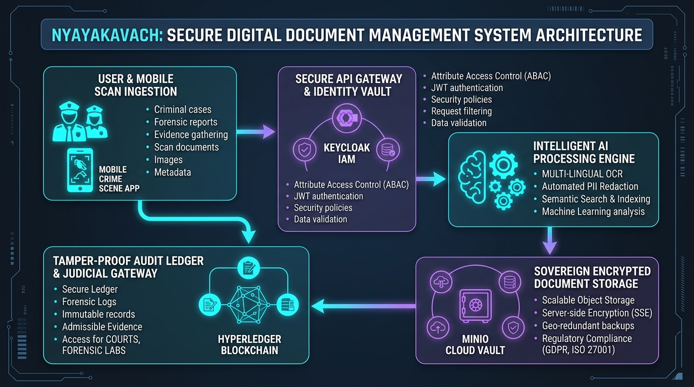
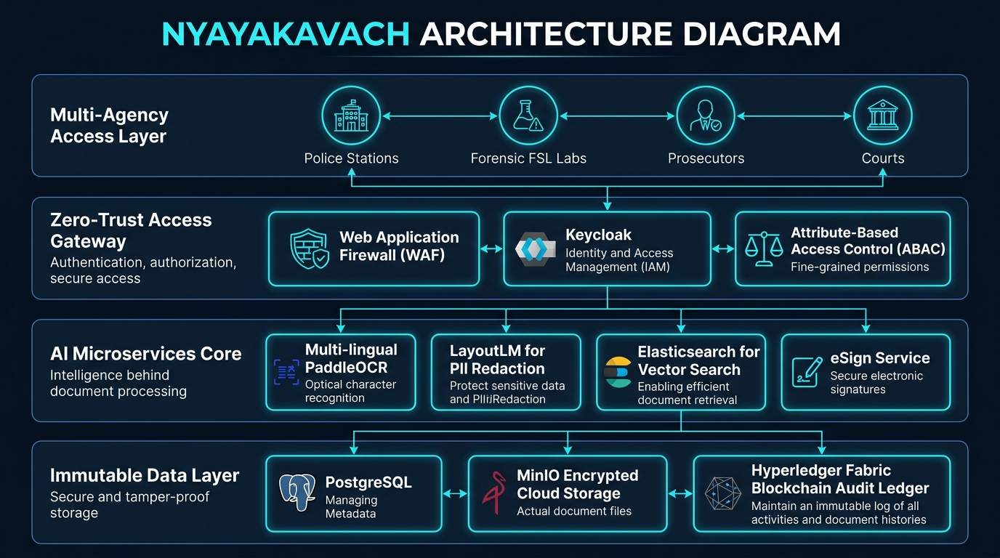

# NyayaKavach – An AI-Driven Secure Digital Document Management and Evidence-Integrity Platform for Legal and Investigation Documents

[](https://www.sih.gov.in/)
[-orange.svg)](https://www.mha.gov.in/)
[](#legal-compliance--admissibility)
[](#security--sovereign-vault)

---

## 🏛️ Executive Summary

**NyayaKavach** (न्यायकवच) is an AI-driven, Zero-Trust, Blockchain-anchored digital document management and evidence-integrity platform engineered specifically for the Indian criminal justice ecosystem. 

It empowers **Law Enforcement Agencies (Police)**, **Forensic Science Laboratories (FSL)**, **Public Prosecutors**, and **Judicial Courts** to securely ingest, classify, redact, store, exchange, and legally verify sensitive investigation documents—including First Information Reports (FIRs), Case Diaries, Charge Sheets, Witness Statements, Forensic Reports, and Judgments.

NyayaKavach ensures **100% evidentiary integrity**, automated bilingual processing, tamper-evident audit trails, and strict compliance with the **Bharatiya Sakshya Adhiniyam (BSA), 2023** and **Section 65B of the Indian Information Technology Act**.

---

## 📸 System Architecture

### High-Level Architecture


### Detailed Architecture Diagram


---

## ⚡ Key Challenges Solved

| Challenge in Traditional Workflow | NyayaKavach Solution |
| :--- | :--- |
| **Tampering & Spoliation Risks**: Vulnerability of physical and digital records during inter-agency transit. | **Blockchain-Anchored Immutable Ledger**: Cryptographic SHA-256 Merkle proofs and Hyperledger Fabric logging. |
| **Chain-of-Custody Gaps**: Inability to verify who accessed, printed, or exported a record. | **Automated Chain-of-Custody Tracking**: Forensic-grade audit trail with dynamic biometric/watermark overlays. |
| **Manual PII Leakage**: Risk of exposing victim identities, undercover officers, and minors. | **Automated AI-Driven PII Redaction**: On-premise NER models redact Aadhaar, phone numbers, victim names in Hindi & English. |
| **Legal Admissibility Bottlenecks**: Lengthy manual generation of Section 65B IT Act / BSA certificates. | **Automated Electronic Evidence Certificates**: Cryptographically signed audit certificates generated instantly for court presentation. |
| **Unindexed Scanned Documents**: Hand-written or low-resolution scanned FIRs and panchnamas difficult to search. | **Multilingual OCR & Semantic Search**: Hybrid search (Elasticsearch + Milvus Vector DB) across English, Hindi, and regional scripts. |

---

## 🛡️ Core Pillars & Features

### 1. Zero-Trust Storage & Sovereign Vault
* **Envelope Encryption**: Files encrypted at client/edge with AES-256-GCM; data keys rotated and protected via HSM / KMS.
* **Storage Independence**: Compatible with sovereign cloud storage (MinIO, AWS S3 / GovCloud) with WORM (Write Once, Read Many) policies.

### 2. Immutable Chain of Custody (Blockchain Audit Trail)
* Every document lifecycle event (Ingestion, Redaction, Viewing, Export, Handoff) is logged into a **Hyperledger Fabric** consortium blockchain.
* Cryptographic Merkle verification guarantees mathematical proof of non-tampering.

### 3. AI-Powered Multilingual Intelligence
* **OCR Ingestion Engine**: Powered by PaddleOCR and LayoutLM for structured extraction from poor-quality scans and handwritten forms.
* **PII & Sensitive Data Redaction**: Automatic identification and redaction of sensitive identifiers in Hindi and English.
* **Hybrid Semantic Retrieval**: Full-text keyword search combined with vector embeddings (Milvus) for cross-case intelligence and legal precedent matching.

### 4. Legal Compliance & Admissibility
* Built from the ground up to comply with **Bharatiya Sakshya Adhiniyam (BSA), 2023** regulations on electronic evidence.
* Automated generation of cryptographically timestamped Section 65B IT Act admissibility certificates.

### 5. Multi-Agency Role-Based Access Control (RBAC & ABAC)
* Fine-grained compartmentalization across Police, Forensic Labs, Prosecution, and Judiciary.
* Dynamic viewer watermarking with viewer identity, timestamp, and IP preventing unauthorized physical capture or leaks.

---

## 🛠️ Technology Stack

* **Frontend**: React.js, TailwindCSS, PDF.js, Flutter (Field Mobile Scan App)
* **Backend Services**: Node.js (Fastify), Python FastAPI (AI Microservices), Go (High-throughput API Gateway)
* **AI & NLP Pipeline**: PaddleOCR, LayoutLM, Llama-3 Legal NLP (Hindi/English PII Redaction)
* **Databases & Search**: PostgreSQL, Elasticsearch, Milvus Vector DB
* **Storage & KMS**: MinIO / S3 Sovereign Cloud, HashiCorp Vault / Hardware Security Module (HSM)
* **Ledger & Integrity**: Hyperledger Fabric Consortium, SHA-256 Merkle Proof Engine

---

## 📂 Repository Contents

```text
├── architecture_diagram.png                           # Comprehensive architectural diagram (PNG)
├── architecture_diagram.jpg                           # Architecture diagram (JPEG format)
├── high_level_architecture.png                        # High-level system architecture schematic
├── high_level_architecture.jpg                        # High-level architecture (JPEG format)
├── NyayaKavach_Poster_Presentation_and_Overview.pdf   # 3-Page project overview & solution brief PDF
├── NyayaKavach_SIH26190_Solution_and_Poster.pdf       # 2-Page technical architecture & solution brief PDF
├── build_full_pitch_pdf.py                            # Standalone Python script to generate 3-page overview PDF
├── build_clean_pdf.py                                 # Standalone Python script to generate 2-page solution PDF
├── generate_pdf.html                                  # Formatted HTML solution poster and presentation
├── make_pdf.js                                        # Node.js PDF generator utility
├── .gitignore                                         # Project git ignore configuration
└── README.md                                          # Documentation & project overview
```

---

## 🚀 Usage & Generation Scripts

### Generate Presentation PDFs
```bash
# Generate the 3-page full pitch document
python3 build_full_pitch_pdf.py

# Generate the 2-page technical solution document
python3 build_clean_pdf.py

# Or generate via Node.js
node make_pdf.js
```

---

## 📜 Legal & Compliance Framework

* **Bharatiya Sakshya Adhiniyam (BSA) 2023** – Electronic Records Admissibility
* **Indian Information Technology Act, 2000** – Section 65B Electronic Evidence Certification
* **Zero-Trust Security Guidelines** – National Informatics Centre (NIC) & CERT-In aligned standards
